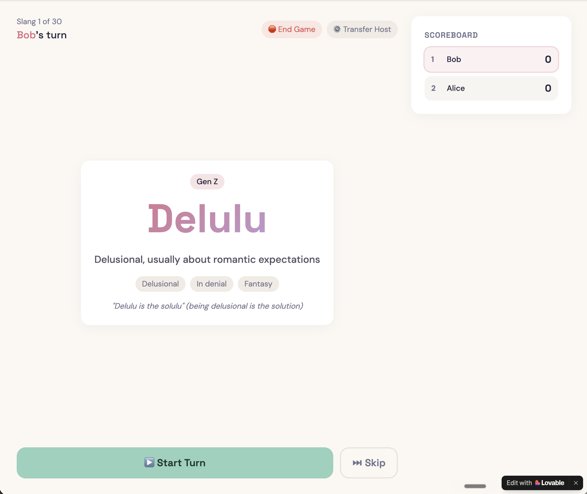
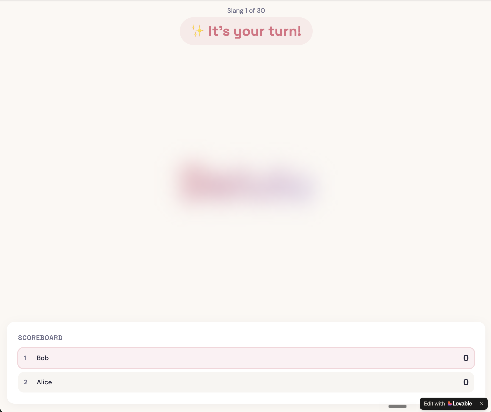
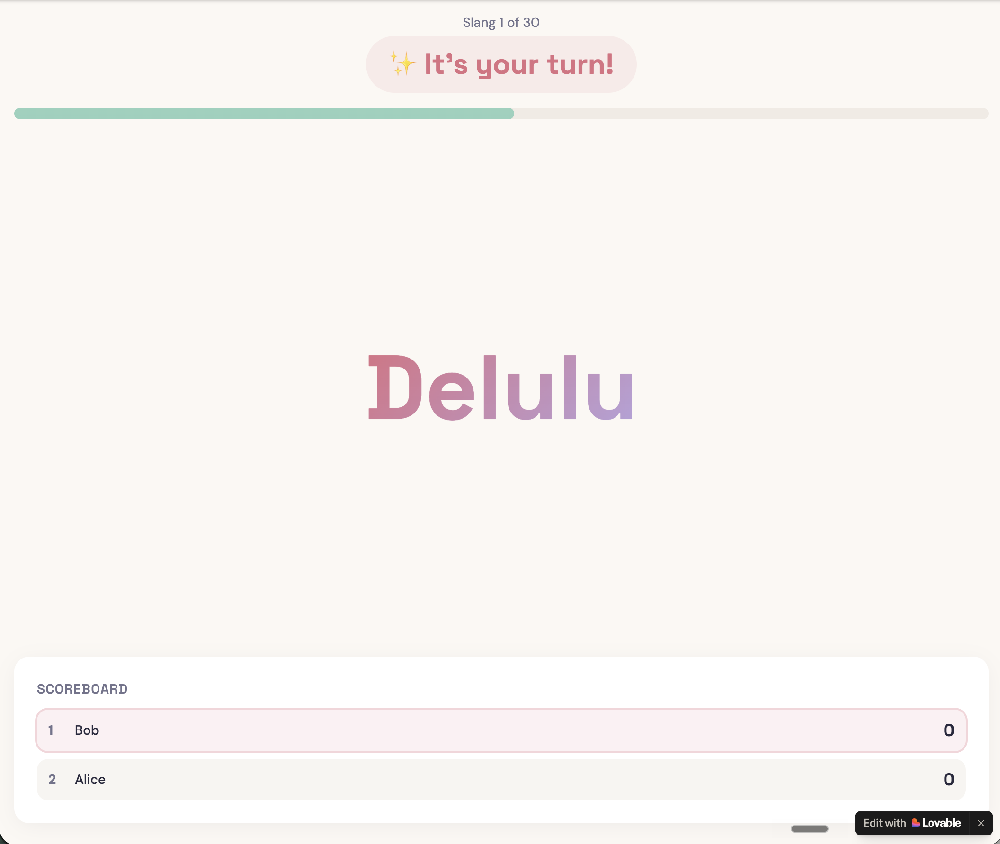

# Guess the Slang

**A real-time multiplayer party game where one player guesses the meaning of generational slangs.**

🎮 **Live app:** [guess-the-slang.lovable.app](https://guess-the-slang.lovable.app/) - Built with Lovable

---

## The Game in 30 Seconds

- One person hosts (facilitator role — they run the game, don't play).
- 2+ players join via a 5-character room code.
- Host picks a generational slang pack (Gen Alpha, Gen Z, Millennial, Gen X, Boomer, or Mixed).
- Each turn has two stages:
  - **Pre-turn:** Host sees the upcoming word + its full definition. Everyone else sees a blurred card. Host decides whether to start the turn or skip the word if its boring.
  - **Active turn:** Host clicks Start Turn → the word is revealed to all players, but only the host knows the meaning. The active player describes the meaning verbally.
- Host marks Correct (player scores) or Pass (next player tries the same word if the first player got it incorrect). 30 words per game.

---

## Core Product Decisions

This section documents the deliberate product calls I made while building. The interesting part isn't the code — it's the decisions.

### 1. Generation packs solve the "is this game for me?" problem

Slang is generational by definition. A Gen Z game played by Gen Z fails fast (because there is not much guessing to do). Because the audience is workplace, with mixed generations, selecting based on who all are participating gives the flexibility.

**Decision:** Six packs — Gen Alpha, Gen Z, Millennial, Gen X, Boomer, and Mixed. The host picks based on their group's composition.

**Default:** Mixed. The expected use case is an intergenerational office, so the default has to work for diverse teams. A wrong default would make the game fail by friction for the most common case.

### 2. Information asymmetry is the core mechanic

Everyone seeing the same thing would break the game. So would *no one* seeing anything. The mechanic is structured in two stages — and the asymmetry shifts at each stage.

**Stage 1 — Pre-turn: host has everything, players have nothing**

*Host's view: full card visible (word, definition, synonyms, fun fact) with Start Turn and Skip controls.*

*What everyone else sees before the host clicks Start Turn: a completely blurred card. No word, no clue.*

**Why this matters:** The host gets a private preview. If the word is boring, too obscure, or already covered, they can **Skip** — and the players never even saw it. No "ugh, that one again" moment. No social pressure to play through a dud.

**Stage 2 — After Start Turn: word revealed, meaning hidden**

*After host clicks Start Turn: the word is revealed to all players. The active player sees "✨ It's your turn!"; waiting players see "[Name]'s turn." Only the host knows the definition.*

**Why this matters:** Once the turn starts, the word is shared but the **meaning** is the asymmetry. You might recognize "Delulu" or "Main Character" without knowing what they mean in Gen Z slang. The active player guesses the meaning verbally; the host confirms.

This is what makes it work as a cross-generational icebreaker: a specific generation might see "Delulu" and have no idea what it means.

### 3. No in-app guessing input

Players don't type their guesses. They shout them out loud across the room.

**Decision:** Reinforce real-world social interaction over digital engagement. The game is an icebreaker — its job is to get people talking to each other, not staring at their phones.

This was a deliberate design constraint, not a missing feature. Adding a guess input would have made the game faster but killed the social dynamic that makes it valuable for office contexts.

### 4. Host is a facilitator, not a player

In Codenames, the spymaster doesn't compete. Same model here.

**Decision:** Host runs the game (Start Turn / Correct / Pass / Skip / End Game / Transfer Host) but doesn't have a score, doesn't take turns, doesn't appear in the scoreboard.

**Why:** In office settings, one person typically projects the game on a screen or runs it from their laptop. They naturally become the facilitator. Forcing them to also play creates conflicting incentives — they'd need to mark their own answers correct, which breaks trust.

### 5. Skip vs. Pass are different primitives

Same button name in other games would conflate two different things.

**Decision:**
- **Skip** (pre-turn, host only): "I don't like this word for this game." Swaps the slang for a NEW word; same player's turn.
- **Pass** (during turn): "This player couldn't guess it." Same slang word goes to the NEXT player.

These are different turn-management actions. Conflating them would make the game feel arbitrary.

### 6. Visual-only timer (no countdown text)

A "0:23 left" countdown creates anxiety. A green bar depleting doesn't.

**Decision:** Timer is a visual progress bar at the top. No numbers, no audio cues, no "5...4...3..." countdown.

This keeps the social energy in the room high instead of stressed.

### 7. Minimum 3 participants (host + 2 players)

A 2-player guessing game has only one guesser at a time — no one to play off, no group dynamic.

**Decision:** Game requires host + 2 players minimum (3 total) to start. Below that, the "Start Game" button is disabled.

### 8. Play Again preserves the group, resets the game

Generating a brand new room code for a play-again would break the social moment ("wait, what code did they say?"). Forcing everyone to copy a new link breaks the flow.

**Decision:** Play Again generates a new room code under the hood, but all currently connected players auto-transfer to the new lobby. Scores reset to 0. Same generation pack default. Host can immediately start.

The transition is invisible to players — they just see "new game, fresh scores, let's go."

### 9. Dropouts are handled gracefully, not rejected

Office environments mean people step away mid-game for calls.

**Decision:**
- Toast notification when a player drops: "ℹ️ [Name] has left the game"
- Player eventually removed from active scoreboard
- Game continues if remaining players ≥ minimum
- If all players drop, game auto-transitions to Final Standings with last-known scores

### 10. Transfer Host as an escape hatch

What if the host has to leave?

**Decision:** Host can transfer the facilitator role to another player mid-game. The game continues without losing state.

This prevents the game from becoming hostage to one person's availability.

---

**Live app:** [guess-the-slang.lovable.app](https://guess-the-slang.lovable.app/)
