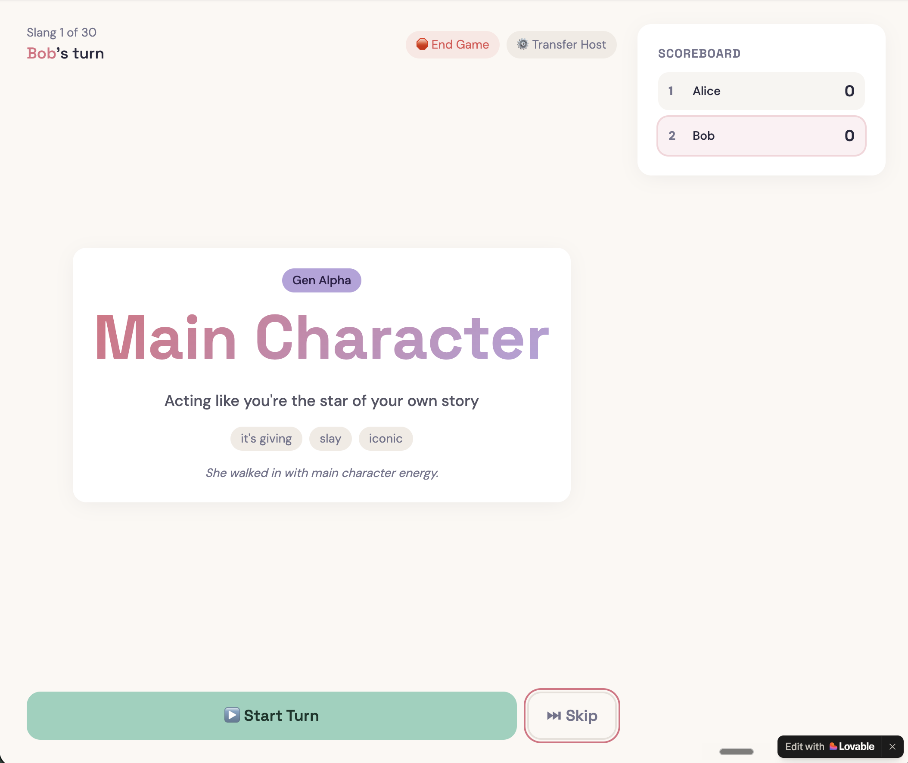
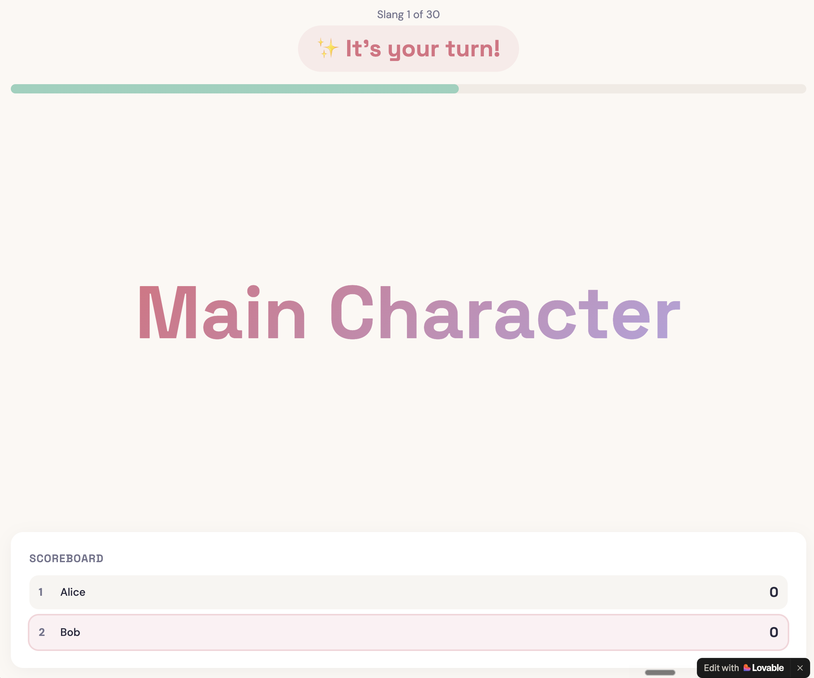
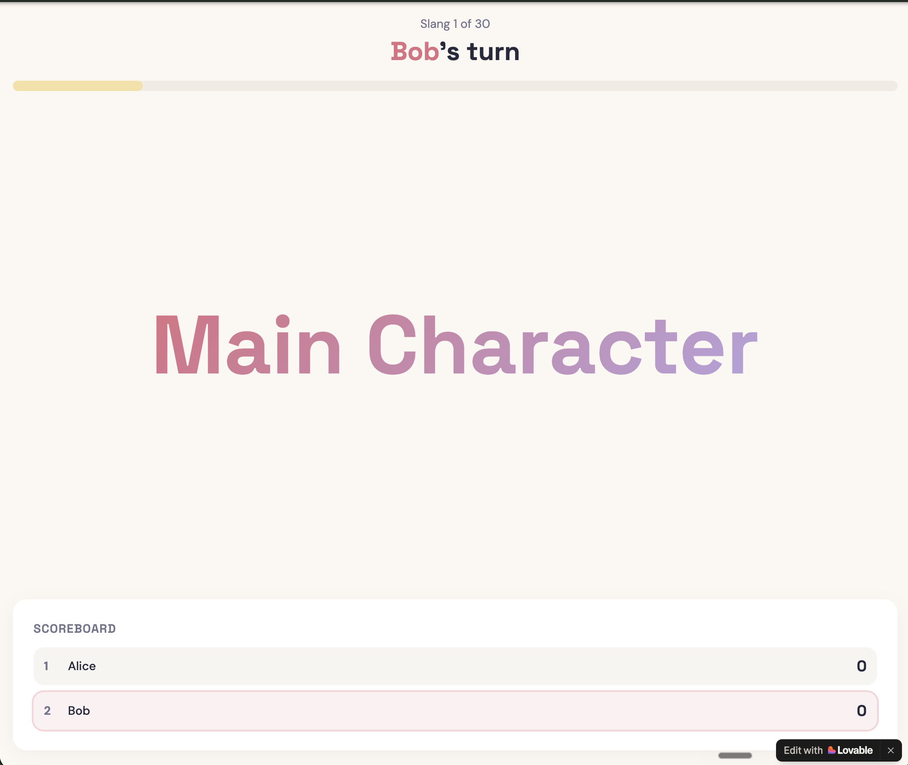

# Guess the Slang

**A real-time multiplayer party game where one player describes generational slang and their teammates guess.**

🎮 **Live app:** [guess-the-slang.lovable.app](https://guess-the-slang.lovable.app/)

Built with [Lovable](https://lovable.dev) to test how far vibe coding can take a real multiplayer product with deliberate UX decisions, not just a toy demo.

---

## The Game in 30 Seconds

- One person hosts (facilitator role — they run the game, don't play).
- 2+ players join via a 5-character room code.
- Host picks a generational slang pack (Gen Alpha, Gen Z, Millennial, Gen X, Boomer, or Mixed).
- Each turn: an active player sees a slang word and describes its meaning verbally. Other players see the word but not the meaning — they have to guess what it means. Host knows the answer and marks Correct or Pass.
- 30 words per game. Highest score wins.

It's structurally similar to Codenames or Time's Up — but designed specifically for cross-generational workplace teams.

---

## Core Product Decisions

This section documents the deliberate product calls I made while building. The interesting part isn't the code — it's the decisions.

### 1. Generation packs solve the "is this game for me?" problem

Slang is generational by definition. A Gen Z game played by Boomers fails fast (they don't know the words and feel excluded). A Boomer game played by Gen Z is just trivia, not play.

**Decision:** Six packs — Gen Alpha, Gen Z, Millennial, Gen X, Boomer, and Mixed. The host picks based on their group's composition.

**Default:** Mixed. The expected use case is an intergenerational office, so the default has to work for diverse teams. A wrong default would make the game fail by friction for the most common case.

### 2. Information asymmetry is the core mechanic

Everyone seeing the same thing would break the game — the "guess" disappears the moment all players see the answer.

**Decision:** Three different views simultaneously, with the host holding the answer key:

| Host view | Active player view | Waiting player view |
|---|---|---|
|  |  |  |
| Sees the word **plus** the definition, synonyms, and fun fact. Controls turn flow. | Sees the word only. Knows it's their turn (`✨ It's your turn!`). Describes the meaning verbally. | Sees the word but not the meaning. Listens to the active player's description. Guesses what the slang means out loud. |

The key insight: the **word** is shared, but the **meaning** is the asymmetry. You might recognize "Main Character" or "Sigma" without knowing what it means in Gen Alpha slang — so the game tests whether players can communicate the actual meaning, not just the word itself.

This is what makes it work as a cross-generational icebreaker: a Boomer might see "Main Character" and have no idea what it means; a Gen Z player has to explain it without saying the definition; everyone learns. If everyone saw everything, the game collapses.

### 3. No in-app guessing input

Players don't type their guesses. They shout them out loud across the room.

**Decision:** Reinforce real-world social interaction over digital engagement. The game is an icebreaker — its job is to get people talking to each other, not staring at their phones.

This was a deliberate design constraint, not a missing feature. Adding a guess input would have made the game faster but killed the social dynamic that makes it valuable for office contexts.

### 4. Host is a facilitator, not a player

In Codenames, the spymaster doesn't compete. Same model here.

**Decision:** Host runs the game (Start Turn / Correct / Pass / Skip / End Game / Transfer Host) but doesn't have a score, doesn't take turns, doesn't appear in the scoreboard.

**Why:** In office settings, one person typically projects the game on a screen or runs it from their laptop. They naturally become the facilitator. Forcing them to also play creates conflicting incentives — they'd need to mark their own answers correct, which breaks trust.

### 5. Skip vs. Pass are different primitives

Same button name in other games would conflate two different things.

**Decision:**
- **Skip** (pre-turn, host only): "I don't like this word for this player." Swaps the slang for a NEW word; same player's turn.
- **Pass** (during turn): "This player couldn't guess it." Same slang word goes to the NEXT player.

These are different turn-management actions. Conflating them would make the game feel arbitrary.

### 6. Visual-only timer (no countdown text)

A "0:23 left" countdown creates anxiety. A green bar depleting doesn't.

**Decision:** Timer is a visual progress bar at the top. No numbers, no audio cues, no "5...4...3..." countdown.

This keeps the social energy in the room high instead of stressed.

### 7. Minimum 3 participants (host + 2 players)

A 2-player guessing game has only one guesser at a time — no one to play off, no group dynamic.

**Decision:** Game requires host + 2 players minimum (3 total) to start. Below that, the "Start Game" button is disabled.

The button label currently says "Need at least 2 players" — which is technically misleading (it means 2 non-host players). This is a known issue worth fixing.

### 8. Play Again preserves the group, resets the game

Generating a brand new room code for a play-again would break the social moment ("wait, what code did they say?"). Forcing everyone to copy a new link breaks the flow.

**Decision:** Play Again generates a new room code under the hood, but all currently connected players auto-transfer to the new lobby. Scores reset to 0. Same generation pack default. Host can immediately start.

The transition is invisible to players — they just see "new game, fresh scores, let's go."

### 9. Dropouts are handled gracefully, not rejected

Office environments mean people step away mid-game for calls.

**Decision:**
- Toast notification when a player drops: "ℹ️ [Name] has left the game"
- Player eventually removed from active scoreboard
- Game continues if remaining players ≥ minimum
- If all players drop, game auto-transitions to Final Standings with last-known scores

**Tradeoff accepted:** No rejoin mechanism. If you leave, you're out. This is a tradeoff I'd revisit — see "What I'd Do Differently" below.

### 10. Transfer Host as an escape hatch

What if the host has to leave?

**Decision:** Host can transfer the facilitator role to another player mid-game. The game continues without losing state.

This prevents the game from becoming hostage to one person's availability.

---

## What I'd Do Differently

A few decisions I'd revisit in a v2:

1. **Allow rejoin within a grace window.** Currently, if a player drops mid-game, they can't rejoin (the join screen says "game has already started"). A 30-second rejoin window would handle the "I lost wifi for a second" case without changing the broader design.

2. **Fix the "Need at least 2 players" button label.** It actually requires 3 total (host + 2). Should say "Need 2 more players" when at 1, or "Need at least 3 players to start" generally.

3. **Tighten RLS policies.** Database security is permissive (`USING true`) because the game has no PII at stake. For any version that stored real data, I'd add row-level policies that only allow updates to your own session.

4. **Track word difficulty/freshness.** Right now words can repeat across games. A simple usage counter per word + per session could ensure variety.

5. **Mobile-responsive testing.** Built and tested at desktop viewport. Office party games should work on phones — needs proper mobile QA.

---

**Live app:** [guess-the-slang.lovable.app](https://guess-the-slang.lovable.app/)
